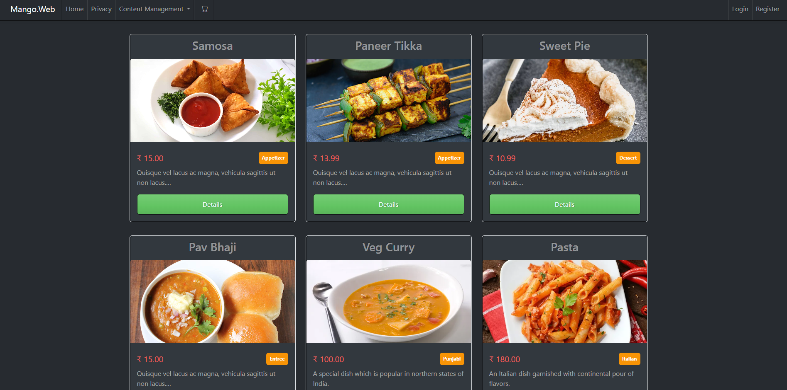

# Online Food Ordering System

Welcome to the Microservices-based Food Ordering System, a .NET Core 8 project designed to facilitate the sale of food products. Admins can effortlessly add and manage food items, while customers can browse and purchase them. 



## Prerequisites

Before you begin, ensure you have the following installed:

- [.NET SDK 8](https://dotnet.microsoft.com/download) or later
- [SQL Server 2017](https://www.microsoft.com/en-us/sql-server/sql-server-downloads) or later

## Key Features

### Admin Dashboard

Effortlessly manage your food empire with a feature-packed Admin Dashboard. Here's what you can do:

- **Add, Edit & Manage Coupons:** Keep your customers engaged with enticing discounts.
- **Food Product Management:** Easily update your menu by adding, editing, and managing a variety of food products.

### Customer Shopping Experience

For the food enthusiasts and hungry souls out there, our system provides a seamless and enjoyable shopping experience:

- **Browse Food Items:** Explore a diverse range of mouthwatering food items conveniently organized for easy navigation.

### Shopping Cart Functionality

Simplify the purchasing process with our intuitive shopping cart feature:

- **Add to Cart:** Select your favorite food items and add them to your shopping cart for a hassle-free checkout experience.

## Getting Started

To begin your journey with the Microservices-based Food Ordering System, follow these steps:

1. **Clone the Repository:** Start by cloning the repository to your local machine using the following command:

    ```bash
    git clone https://github.com/jenilvora0408/.NET_Core_Microservices_Architecture
    ```

2. **Modify `appsettings.json`:** Customize the connection string for all services in the `appsettings.json` file. Locate the `"ConnectionStrings"` section and update the `"DefaultConnection"` value with your SQL Server details:

    ```json
    "ConnectionStrings": {
      "DefaultConnection": "Data Source=Your_Server_Name;Initial Catalog=Database_Name;User ID=user_id;Password=password;TrustServerCertificate=true"
    }
    ```

3. **Configure Startup Projects:**
   - Right-click on the solution and select "Configure Startup Projects."
   - Choose the "Multiple Startup Projects" option.
   - Set the action to "Start" for each project in the list.
   - Click "Apply" and then "OK."

4. **Run the Project:** Once configured, run the project. The database will be created automatically during the project startup.

These steps ensure a smooth setup of the Microservices-based Food Ordering System on your local environment. For additional details and troubleshooting, refer to our comprehensive documentation.
